# Data Discovery Agent - LangGraph Pipeline

## Project Description

The Data Discovery Agent is an intelligent, multi-stage pipeline for **automatic schema matching and column mapping** between source and target databases. Using LLM-powered agents, statistical analysis, and business glossary context, the system identifies semantic relationships between database columns and generates transformation rules.

### Use Cases
- **Database Migration** - Map source schema to target schema automatically
- **Data Integration** - Discover relationships between disparate data systems
- **ETL Automation** - Generate transformation logic for data pipelines
- **Master Data Management** - Identify canonical entities across systems
- **KYC/Identity Verification** - Map customer and identity data across telecom platforms

### Key Capabilities
- ✅ **Multi-factor Scoring** - Combines name similarity, data type, cardinality, and statistical metrics
- ✅ **LLM-Powered Matching** - Uses GPT-4o for semantic understanding and entity recognition
- ✅ **Business Glossary** - Leverages domain terminology to improve accuracy
- ✅ **Lookup Table Discovery** - Identifies and maps dimension/reference tables
- ✅ **Hybrid Similarity Engine** - Fuzzy matching + embeddings + LLM consensus
- ✅ **Detailed Scoring Breakdown** - Full transparency on scoring decisions

---

## Pipeline Architecture

```mermaid
flowchart LR
	START([Start]) --> ES["📊 Extract Schema<br/>(No LLM)"]
	ES --> PD["📈 Profile Data<br/>(No LLM)"]
	PD --> DE["🤖 Discover Entities<br/>(LLM)"]
	DE --> DL["📋 Discover Lookups<br/>(No LLM)"]
	DL --> SC["⭐ Score Candidates<br/>(LLM)"]
	SC --> SM["🔄 Semantic Mapping<br/>(LLM)"]
	SM --> ML["🔗 Map Lookups<br/>(LLM)"]
	ML --> END([End])
	
	style ES fill:#e8f4f8
	style PD fill:#e8f4f8
	style DL fill:#e8f4f8
	style DE fill:#fff4e6
	style SC fill:#fff4e6
	style SM fill:#fff4e6
	style ML fill:#fff4e6
```



**Legend**: 🤖 = LLM-powered agent | 📊 = Statistical analysis | 📈 = Data profiling | ⭐ = Multi-factor scoring | 🔄 = Transformation logic | 🔗 = Value mapping

---

## Agent Specifications

### 1. Schema Extract Agent (`schema_extract_agent.py`)
**Purpose**: Extract relational schema metadata from source and target databases

**Functionality**:
- Connects to PostgreSQL databases via SQLAlchemy
- Extracts table names, column definitions, and data types
- Identifies foreign key relationships and constraints
- Returns structured schema dictionary with column metadata

**Output**:
```python
{
  "table_name": {
    "columns": [
      {"column": "id", "type": "INTEGER", "nullable": False},
      {"column": "name", "type": "VARCHAR", "nullable": True}
    ],
    "foreign_keys": [...]
  }
}
```

---

### 2. Data Profile Agent (`data_profile_agent.py`)
**Purpose**: Profile tables with statistical fingerprints for similarity matching

**Functionality**:
- Computes distribution statistics: entropy, cardinality, null ratios
- Extracts sample values from each column
- Analyzes data type patterns and regex rules
- Generates column profiles for comparison

**Profile Metrics**:
- `entropy` - Information entropy of column values (0-1, higher = more diverse)
- `cardinality` - Unique value count (normalized 0-1)
- `null_ratio` - Percentage of NULL values
- `samples` - Sample values for manual inspection
- `regex` - Data pattern (e.g., phone numbers, IDs)

---

### 3. Entity Discovery Agent (`entity_discovery_agent.py`) 🤖 **LLM-Powered**
**Purpose**: Discover and label business entities (clusters of related tables)

**Methodology**:
1. **Graph Construction** - Build relationship graph using foreign key constraints
2. **Connected Components** - Find table clusters using NetworkX
3. **LLM Labeling** - Use GPT-4o to assign semantic entity names
4. **Glossary Enhancement** - Inject business glossary entity definitions for context

**Example Output**:
```json
{
  "Customer": {"tables": ["party", "party_address", "party_identifier"]},
  "Account": {"tables": ["account", "billing"]},
  "Subscription": {"tables": ["service_subscription", "plan"]}
}
```

---

### 4. Lookup Discovery Agent (`lookup_discovery_agent.py`)
**Purpose**: Identify lookup/dimension tables (reference data, codebooks)

**Heuristics**:
- Small row count (< 1000 typically)
- High cardinality columns (IDs)
- Few foreign key references
- Common naming patterns (codes, statuses, types)

**Example**: `status_codes`, `country_list`, `payment_methods`

---

### 5. Name Similarity Engine (`name_similarity.py`) 🤖 **LLM-Fallback**
**Purpose**: Compute semantic similarity between column names

**Hybrid 3-Level Approach**:

#### Level 1: Fuzzy Matching (Fast)
- Uses **token_sort_ratio** from rapidfuzz
- Threshold: ≥ 0.85 confidence → return immediately
- Example: `customer_id` ↔ `cust_id` = 0.90 ✓

#### Level 2: Embedding Similarity (Accurate)
- Converts column names to embeddings using OpenAI `text-embedding-3-small`
- Computes cosine similarity
- Threshold: ≥ 0.85 confidence → return immediately
- Example: `date_of_birth` ↔ `birthdate` = 0.88 ✓

#### Level 3: LLM Semantic Comparison (Comprehensive) 🤖
- Uses GPT-4o for final decision
- Injects business glossary column definitions
- Returns score 0.0-1.0
- **Fallback when fuzzy/embedding inconclusive**

**Example Scores**:
```
dob ↔ date_of_birth                     = 1.0  (perfect match)
msisdn ↔ mobile_number                  = 0.9  (semantic equivalence)
cust_id ↔ customer_identifier           = 0.95 (same meaning)
gender ↔ email                          = 0.0  (unrelated)
```

---

### 6. Candidate Score Agent (`candidate_score_agent.py`)
**Purpose**: Compute final confidence score for each column mapping candidate

**Multi-Factor Scoring Formula**:
```
final_score = (
    0.35 × name_similarity +
    0.25 × regex_score +
    0.15 × entropy_score +
    0.15 × cardinality_score +
    0.10 × null_ratio_score
)
```

**Component Breakdown**:

| Factor | Weight | Purpose |
|--------|--------|---------|
| **Name Similarity** | 35% | Semantic match (fuzzy/embedding/LLM) |
| **Regex Score** | 25% | Data type pattern alignment |
| **Entropy Score** | 15% | Value distribution similarity |
| **Cardinality Score** | 15% | Unique value count match |
| **Null Ratio Score** | 10% | Missing data pattern similarity |

**Decision Logic**:
- Score ≥ 0.85 → `ACCEPTED` (high confidence)
- Score 0.65-0.85 → `HUMAN_REVIEW` (moderate confidence)
- Score < 0.65 → `REJECTED` (low confidence)

---

### 7. Semantic Mapping Agent (`sematic_mapping_agent.py`) 🤖 **LLM-Powered**
**Purpose**: Determine transformation rules and mapping types

**Mapping Types**:
- **Direct** - Single source column maps directly (no transformation)
- **Derived** - Multiple source columns combined (concat, case, decode)
- **Conditional** - Rule-based transformation (if/else logic)
- **Lookup** - Value mapping via dimension table

**Transformation Examples**:
```sql
-- Direct
SELECT customer_id FROM source.customer

-- Derived (concat)
SELECT CONCAT(first_name, ' ', last_name) AS full_name FROM source.party

-- Conditional
SELECT CASE 
  WHEN verification_status = 'VERIFIED' THEN 'KYC_APPROVED'
  ELSE 'KYC_PENDING'
END AS kyc_status

-- Lookup
SELECT mapping.target_value 
FROM source_lookup sl
JOIN lookup_mapping mapping ON sl.source_value = mapping.source_value
```

**LLM Process**:
1. Analyzes target column name and type
2. Reviews top 3 source column candidates
3. Examines sample values
4. Uses business glossary for context
5. Returns JSON with mapping type and SQL expression

---

### 8. Lookup Mapping Agent (`lookup_mapping_agent.py`) 🤖 **LLM-Powered**
**Purpose**: Map value transformations for lookup/reference tables

**Example**:
```
Source Status → Target Status
'ACTIVE'      → '1'
'INACTIVE'    → '0'
'PENDING'     → '2'
```

**Process**:
- Matches source and target lookup tables
- Creates value mapping dictionary
- Generates SQL CASE statements for transformations
- Handles missing values and edge cases

---

## Business Glossary Integration

The **business_glossary.json** file enriches all agents with domain terminology:

### Entity Definitions
```json
{
  "entities": {
    "Customer": "Individual or organization purchasing telecom services",
    "Account": "Billing account for service charges",
    "Subscription": "Active service plan assigned to customer"
  }
}
```

### Column Definitions
```json
{
  "columns": {
    "party_id": "Canonical enterprise customer identifier",
    "msisdn": "Mobile phone number (E.164 format)",
    "kyc_status": "Know Your Customer verification result",
    "billing_cycle_cd": "Invoice frequency (monthly/quarterly)"
  }
}
```

### Agent Usage:
- **Entity Discovery** - Matches discovered table clusters to glossary entities
- **Semantic Mapping** - Uses column definitions to guide transformation rules
- **Name Similarity** - Injects glossary context into LLM comparison

---

## Score Calculation Deep Dive

### Name Similarity Calculation
```
Step 1: Fuzzy Match
  score = token_sort_ratio("source_col", "target_col") / 100
  if score ≥ 0.85: RETURN score
  
Step 2: Embedding Similarity
  source_embedding = embed("source col")
  target_embedding = embed("target col")
  score = cosine_similarity(source_embedding, target_embedding)
  if score ≥ 0.85: RETURN score
  
Step 3: LLM Semantic
  prompt = "Compare '{source_col}' and '{target_col}'. Return score 0-1."
  + [Business Glossary Context]
  score = LLM response
  RETURN score
```

### Final Score Calculation
```
1. Extract Profile Metrics:
   - entropy_sim = 1 - |src_entropy - tgt_entropy| / max(src, tgt)
   - cardinality_sim = 1 - |src_card - tgt_card| / max(src, tgt)
   - null_sim = 1 - |src_null% - tgt_null%|
   - regex_sim = pattern_compatibility_score()
   - name_sim = hybrid_name_similarity()

2. Compute Weighted Score:
   final_score = (0.35 × name_sim) + 
                 (0.25 × regex_sim) + 
                 (0.15 × entropy_sim) + 
                 (0.15 × cardinality_sim) + 
                 (0.10 × null_sim)

3. Assign Decision:
   if final_score ≥ 0.85: ACCEPTED
   elif final_score ≥ 0.65: HUMAN_REVIEW
   else: REJECTED
```

---

## Output Files

### Mapping Results - Full (All Candidates)
**File**: `mapping_results_TIMESTAMP.csv`

Top 5 candidates for each target column with complete scoring breakdown.

### Mapping Results - Rank 1 (Best Match Only)
**File**: `mapping_results_rank1_TIMESTAMP.csv`

Best suggested mapping for each target column - ideal for quick review.

### CSV Columns
| Column | Description |
|--------|-------------|
| `target_table.target_column` | Target column identifier |
| `source_table.source_column` | Matched source column |
| `final_score` | Combined confidence (0-1) |
| `name_similarity` | Semantic name match score |
| `regex_score` | Data type compatibility |
| `entropy_score` | Distribution similarity |
| `cardinality_score` | Unique value count match |
| `null_ratio_score` | Missing value pattern match |
| `similarity_method` | How similarity was determined (fuzzy/embedding/llm) |
| `decision` | ACCEPTED/HUMAN_REVIEW/REJECTED |
| `mapping_type` | direct/derived/conditional/lookup |
| `transformation_sql` | SQL transformation expression |

---

## Setup & Usage

### Setup (Windows PowerShell)

```powershell
# Activate virtual environment
.\.venv\Scripts\activate

# Install dependencies
pip install -r requirements.txt

# Set OpenAI API key
$env:OPENAI_API_KEY="sk-..."
```

### Run Full Pipeline

```powershell
python .\langraph_pipeline.py
```

Update `SOURCE_DB` and `TARGET_DB` in [langraph_pipeline.py](langraph_pipeline.py#L768-L770) with your database URLs.

---

## Dependencies

- `langchain>=0.1.0` - LLM orchestration
- `langchain-core>=0.1.0` - LCEL chains
- `langchain-openai>=0.1.0` - GPT-4o integration
- `networkx>=3.2` - Entity graph clustering
- `sqlalchemy>=2.0` - Database connections
- `pandas>=2.0.0` - Data manipulation
- `numpy>=1.26.0` - Numerical operations
- `rapidfuzz>=3.0.0` - Fuzzy string matching
- `openai>=1.0.0` - Embeddings API
